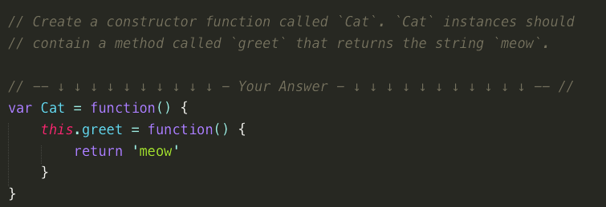

# Intro to Constructors

**Iron Yard Class Assignment**

This repo contains javascript constructor exercises.

## Screenshot


## Installation
```
git clone https://github.com/ReggEvans/funWithConstructors.git
cd funWithConstructors
git remote remove origin
npm install
npm install -g mocha (you only need to do this once, ever)
write answers in worksheet.js
check work with **bash checkWork.sh** in terminal
```

